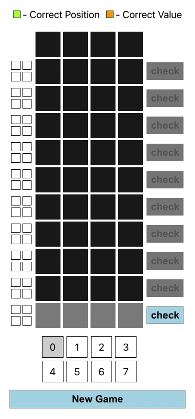
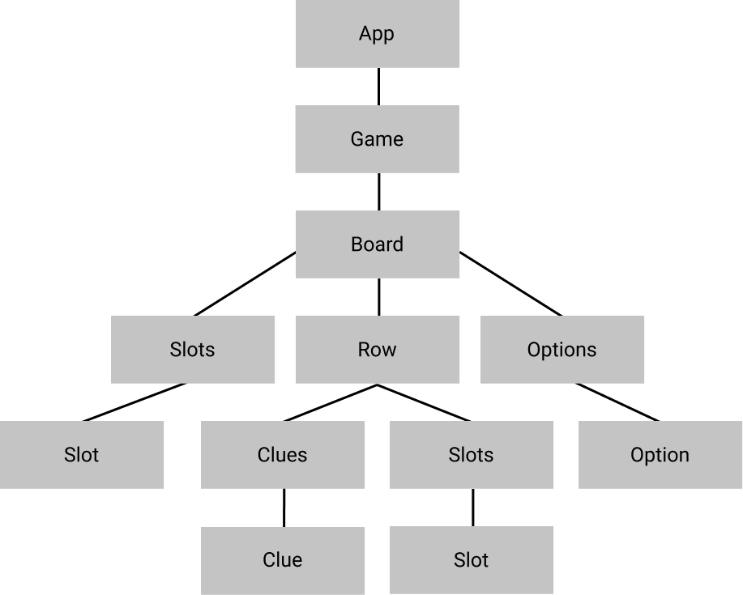

# Mastermind

# How to Play
## Online
1. Visit [this link](https://mastermind-react-hooks.netlify.app/).
2. Start playing!

## Offline
1. Clone the repo
2. Run `npm install`
3. Run `npm start`
4. Start playing!

# Component Hierarchy
